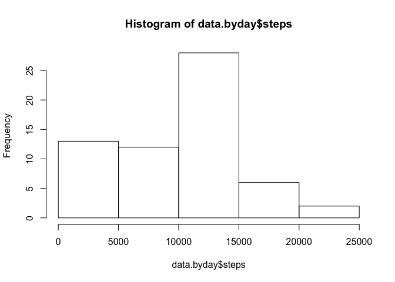
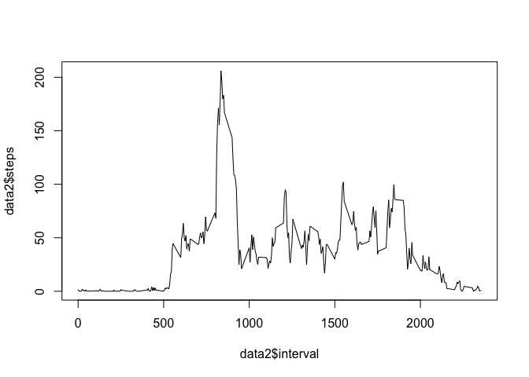

# Reproducible Research: Peer Assessment 1


## Loading and preprocessing the data

```r
unzip("activity.zip")
data<-read.csv("activity.csv", na.strings="NA", stringsAsFactor=FALSE)
data$date <- as.Date(strptime(data$date, "%Y-%m-%d"))
```
Here is the data structure:

```r
str(data)
```

```
## 'data.frame':	17568 obs. of  3 variables:
##  $ steps   : int  NA NA NA NA NA NA NA NA NA NA ...
##  $ date    : Date, format: "2012-10-01" "2012-10-01" ...
##  $ interval: int  0 5 10 15 20 25 30 35 40 45 ...
```
The data now looks like:

```r
head(data)
```

```
##   steps       date interval
## 1    NA 2012-10-01        0
## 2    NA 2012-10-01        5
## 3    NA 2012-10-01       10
## 4    NA 2012-10-01       15
## 5    NA 2012-10-01       20
## 6    NA 2012-10-01       25
```

## What is mean total number of steps taken per day?

```r
data1<-aggregate(data$steps,by=list(data$date),sum, na.rm=TRUE)
colnames(data1)<- c("date","steps")
hist(data1$steps)
```

 

```r
mean(data1$steps, na.rm=TRUE)
```

```
## [1] 9354.23
```

```r
median(data1$steps, na.rm=TRUE)
```

```
## [1] 10395
```


## What is the average daily activity pattern?

```r
data2<-aggregate(data$steps,by=list(data$interval),mean, na.rm=TRUE)
colnames(data2)<- c("interval","steps")
plot(data2$interval,data2$steps, type="l")
```

 


```r
data2$interval[which.max(data2$steps)]
```

```
## [1] 835
```

## Imputing missing values
1. Calculate and report the total number of missing values in the dataset (i.e. the total number of rows with NAs)

```r
sum(!complete.cases(data))
```

```
## [1] 2304
```

2. Devise a strategy for filling in all of the missing values in the dataset. The strategy does not need to be sophisticated. For example, you could use the mean/median for that day, or the mean for that 5-minute interval, etc.
Let's have a look as to where are the missing values:

```r
data$complete <- complete.cases(data)
aggregate(data$complete,by=list(data$date),sum, na.rm=TRUE)
```

```
##       Group.1   x
## 1  2012-10-01   0
## 2  2012-10-02 288
## 3  2012-10-03 288
## 4  2012-10-04 288
## 5  2012-10-05 288
## 6  2012-10-06 288
## 7  2012-10-07 288
## 8  2012-10-08   0
## 9  2012-10-09 288
## 10 2012-10-10 288
## 11 2012-10-11 288
## 12 2012-10-12 288
## 13 2012-10-13 288
## 14 2012-10-14 288
## 15 2012-10-15 288
## 16 2012-10-16 288
## 17 2012-10-17 288
## 18 2012-10-18 288
## 19 2012-10-19 288
## 20 2012-10-20 288
## 21 2012-10-21 288
## 22 2012-10-22 288
## 23 2012-10-23 288
## 24 2012-10-24 288
## 25 2012-10-25 288
## 26 2012-10-26 288
## 27 2012-10-27 288
## 28 2012-10-28 288
## 29 2012-10-29 288
## 30 2012-10-30 288
## 31 2012-10-31 288
## 32 2012-11-01   0
## 33 2012-11-02 288
## 34 2012-11-03 288
## 35 2012-11-04   0
## 36 2012-11-05 288
## 37 2012-11-06 288
## 38 2012-11-07 288
## 39 2012-11-08 288
## 40 2012-11-09   0
## 41 2012-11-10   0
## 42 2012-11-11 288
## 43 2012-11-12 288
## 44 2012-11-13 288
## 45 2012-11-14   0
## 46 2012-11-15 288
## 47 2012-11-16 288
## 48 2012-11-17 288
## 49 2012-11-18 288
## 50 2012-11-19 288
## 51 2012-11-20 288
## 52 2012-11-21 288
## 53 2012-11-22 288
## 54 2012-11-23 288
## 55 2012-11-24 288
## 56 2012-11-25 288
## 57 2012-11-26 288
## 58 2012-11-27 288
## 59 2012-11-28 288
## 60 2012-11-29 288
## 61 2012-11-30   0
```
All the missing values are located on specific dates. A give date has either no missing value (288 values), or all values are missing (0). I suggest we use the mean for that specific 5-minute interval across all days.


3. Create a new dataset that is equal to the original dataset but with the missing data filled in.


```r
library(dplyr)
```

```
## 
## Attaching package: 'dplyr'
## 
## The following object is masked from 'package:stats':
## 
##     filter
## 
## The following objects are masked from 'package:base':
## 
##     intersect, setdiff, setequal, union
```

```r
data5<-merge(data, data2,by=c("interval"), all.x=TRUE, sort=FALSE)
data5$steps<-ifelse(data5$complete, data5$steps.x,data5$steps.y)
data5$steps.x<-NULL
data5$steps.y<-NULL
data5$complete<-NULL
data5<-arrange(data5, date)
```


## Are there differences in activity patterns between weekdays and weekends?
